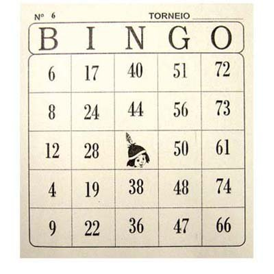

 

# Bingo Game

Implementaremos um jogo de Bingo com suporte a sala de jogos e webchat. Usaremos esse projeto para testar algumas tecnologias. As tecnologias que tentaremos usar são:

- [Stenciljs](https://stenciljs.com/)
- [VueJS](https://vuejs.org/)
- [Lerna](https://github.com/lerna/lerna)
- [ReactJS](https://reactjs.org/)
- [Redux](https://redux.js.org/)
- [NuxtJs](https://nuxtjs.org/)
- [NextJs](https://nextjs.org/)

## Requisitos

- O jogador deve selecionar qual será a quantidade de pedras que serão sorteadas 75 (default) ou 90.
- A quantidade escolhida será dividida por 5 colunas no qual cada coluna será representa por cada letra da palavra B.I.N.G.O.
- O jogador terá opção de convidar mais pessoas para participar do jogo
- Cada participante do jogo terá uma cartela gerada automáticamente
- Cada cartela gerada deverá respeitar qual jogo foi escolhido (75 ou 90 pedras)
- Cada cartela terá 24 número gerados. Sendo 5 números gerados para cada coluna da palavra B.I.N.G.O. (imagem em anexo). O campo da coluna N na linha 3 será o ícone do jogo, por isso da 24 números e não 25.
- Quando o jogo iniciar ele falará cada pedra sorteada com a letra e o número. Ex: B13 ou O65.
- O jogador terá que clicar na coluna e linha correspondente a pedra falada pelo jogo, para marcar o ponto.
- Quando um dos participantes preencher toda a cartela o jogo falará a palavra BINGO.
- Depois disso o jogo ira verificar se o jogador realmente ganhou, pois ele pode ter marcado algum número errado.
- Se tiver errado ele perde
- Se tiver certo ele ganha e fim do jogo.

